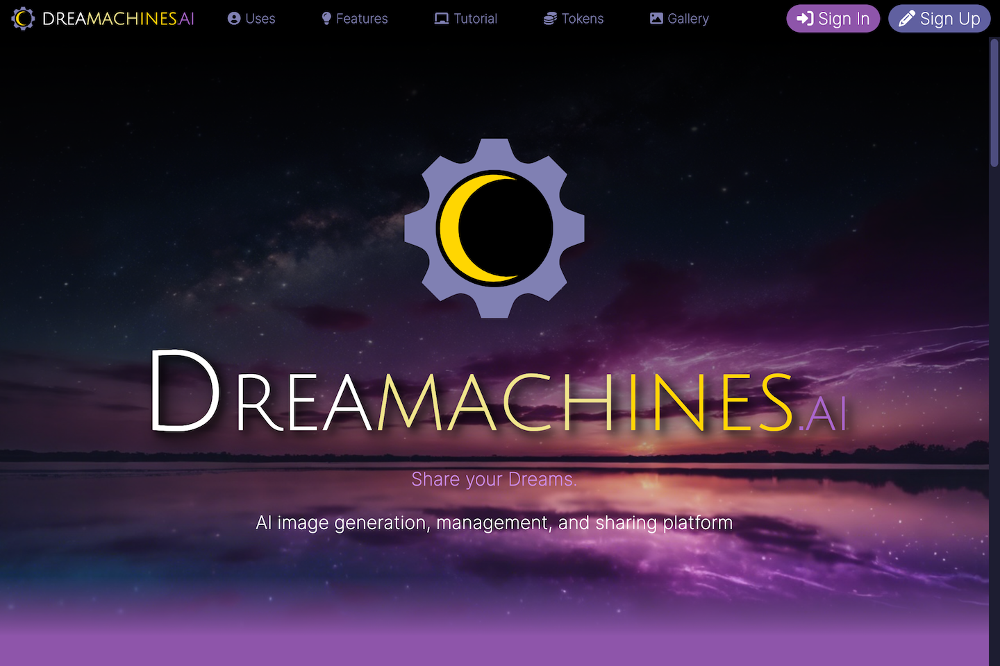

  

    
  

# Dreamachines

Explore your dreams using AI image generation technology. Using simple text prompts, you can visualize virtually anything that you can think of. Dreamachines makes this easier by allowing you to access a variety of image generation engines and a variety of sharing mechanisms all from a single, easy to use user interface. Let Dreamachines help to you explore and share your dreams.

Welcome Screen

Desktop

## Features

- Image Generation - Embrace your imagination! Create fantastic images and visualize your dreams. By simply typing in a text prompt, you can generate images or you can use the advanced features to fine tune your images.
- Image Enhancement - Use DreamKitty to enhance your existing images. Take a generated image or a photograph and apply prompts and styles to transform it into something new.
- Image Management - The easy to use image management capabilities make it easy for you to organize an manage your collection of generated images. It works just like the file browser on your desktop operating system to it's easy to use and you already know how to use it!
- Image Sharing - The various sharing capabilities allow you to share your creations with friends and colleagues. You can share by link, email, discussion topic, or chat message.

## Benefits

- Imagination - DreamKitty can help you to imagine things as they could be, which is the first step towards making those dreams a reality.
- Inspiration - Brainstorming, conceptualization, visualization. Whatever you choose to call it, AI image generation is a useful tool for engaing your creativity.
- Fun - It's undeniable that AI image generation is just plain fun. Sometimes it's funny, sometimes it's surprising, sometimes it's magical. Either way, it's always fun.
- Prototyping - AI image generation is a useful tool early in the design phase of a project. It allows you to quickly generate drafts of ideas that can be refined later on.
- Design - Whether you're desiging conceptual items like logos or more concrete objects like houses, AI image generation can help you to visualize your design ideas.
- Branding - Whether you're desiging your company branding or your own personal brand, DreamKitty can help you to stand out.
- Fashion - AI image generation is a super tool for virtually trying out different looks and garments in a way that's lightning fast and infinitely variable. It's like having an infinite closet and wardrobe.
- Community - Dreamachines provides a community forum for sharing your images and for appreciating and learning from the ideas of others.

## Live Demo

You can create an account and explore the features and benefits of the platform at [www.dreamachines.ai](https://www.dreamachines.ai).

## Image Generators

Dreamachines uses a number of different image generators to create generative images.  You should have an account set up with at least one of these to enable image generation.

- Stability.ai 
- OpenAI / Dall-E
- DeepAI
- Stable Diffusion API

## Installation

Please follow the instructions in [www.dreamachines.ai/#installation](https://www.dreamachines.ai/#installation) to install the software on your computer or web server.

## Instructions

See the [Sharedigm User Guide](https://www.sharedigm.com/#help) for instructions on how to use the platform.

## Installation

Please follow the instructions in [www.dreamachines.ai/#installation](https://www.dreamachines.ai/#installation) to install the software on your computer or web server.

## License

Distributed under the Sustainable Use License which allows urestricted use of the software but does not allow you to commercialize it. See [LICENSE.md](LICENSE.md) for more information.

## Contact

mailto:admin@sharedigm.com
